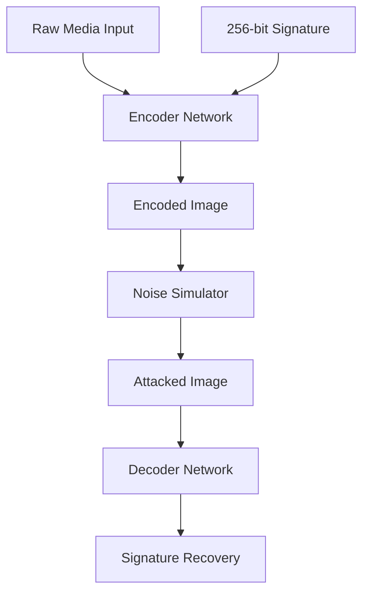

# NeuroMark 🧠🛡️
[](https://developers.google.com/community/gdsc-solution-challenge)
[](https://opensource.org/licenses/MIT)
[](https://www.python.org/)
[](https://tensorflow.org/)

**NeuroMark** is an enterprise-grade, invisible neural watermarking system built for digital asset protection. It utilizes Adversarial Autoencoders (AAE) to embed robust cryptographic signatures directly into image tensors, remaining invisible to the human eye while surviving aggressive adversarial perturbations (JPEG compression, Gaussian noise, cropping, etc.).

Designed for scale on Google Cloud (Vertex AI, Cloud Run, GCS), NeuroMark intercepts data scrapers and unauthorized GenAI training pipelines by ensuring irrefutable cryptographic provenance.

---

## 🚀 Key Features

* **Adversarial Autoencoder Engine:** Uses a continuous noise layer simulation during the forward pass to force the encoding to be resilient against image manipulation.
* **Invisible Sub-Perceptual Steganography:** The discriminator forces the watermark into high-frequency spatial domains.
* **Google Cloud Native:** Serverless inference endpoints via Vertex AI and async processing pipelines hosted on Cloud Run.
* **Enterprise CLI (Agentic):** A highly polished, agent-ready terminal interface built with `rich` for batch processing pipelines.
* **Production-Ready API:** FastAPI backbone complete with Pydantic validation, CORS, and robust error handlers.

## 📦 Architecture


## 🛠️ Quick Start

**1. Clone & Setup**
```bash
git clone https://github.com/your-org/NeuroMark.git
cd NeuroMark/neuromark-core
make install
```

**2. Train the Core Models**
```bash
make train
```

**3. Run the API locally**
```bash
make api
```

**4. Start The Web App
```bash
make dev
```
